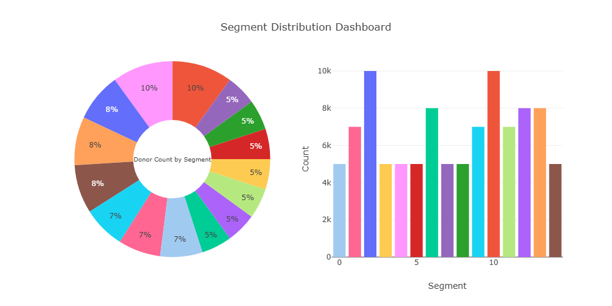
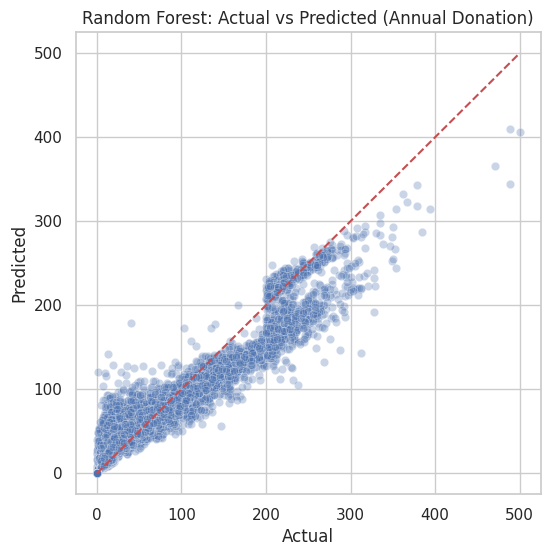
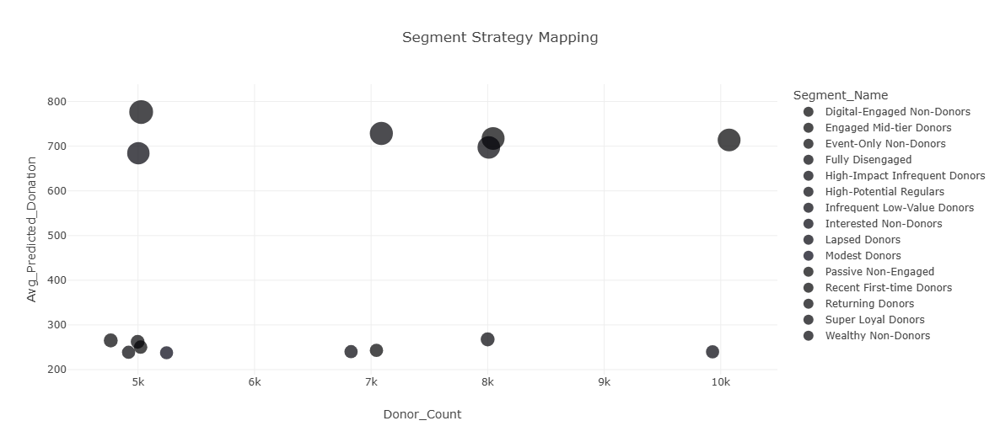
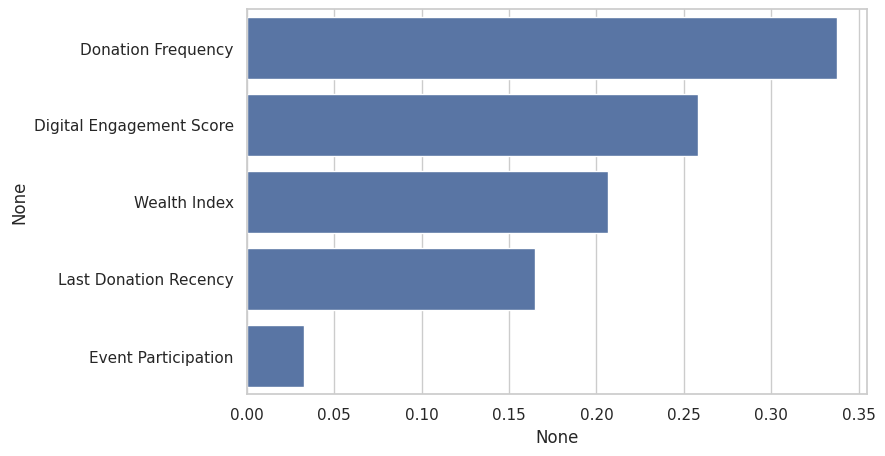

# Donor Analytics Capstone Project (Synthetic Version)

This repository demonstrates the analytical workflow developed for a nonprofit donor segmentation and forecasting project, originally conducted for the **Grand Canyon Council, Scouting America**.

🚫 **Note:** All data in this repository is synthetic. No real donor or constituent information is exposed.

---

## Project Overview

The project aimed to:
- Reverse donation stagnation by identifying high-value donor segments
- Build predictive models to forecast donation behavior
- Develop strategic recommendations for targeted outreach
- Demonstrate the use of synthetic data for safe, shareable analysis

---

## Tools & Methods

**Conceptual:**
- RFM Segmentation (Recency, Frequency, Monetary)
- Behavioral Economics
- Strategic Persona Mapping

**Technical:**
- Python (pandas, scikit-learn, seaborn)
- Random Forest Regressor for donation prediction
- K-Means Clustering for behavior-based segmentation
- Streamlit Dashboard (in full project)

---

## Synthetic Dataset Features

The synthetic dataset simulates realistic donor behavior based on statistical distributions derived from anonymized trends:

| Column                         | Description                                   |
|-------------------------------|-----------------------------------------------|
| Donor ID                      | Unique synthetic donor identifier             |
| Donation Frequency            | Annual donation count                         |
| Average Donation              | Average donation amount in USD               |
| Digital Engagement Score      | Digital interaction intensity (0–100)         |
| Last Donation Recency (months)| Months since last donation (0–36)             |
| Wealth Index                  | Proxy for financial capacity (0–100)          |
| Event Participation           | Encoded level of event attendance (0–3)       |

---

## Sample Visuals (Not Included Here)

In the full report and internal version, we developed:
- RFM segment distribution plots
  
- Donation trend lines over years
- Predicted vs. actual donation scatterplots
  
- Segment-specific strategy tables
  
- Feature Importance
  
> ⚠️ All data used in these visualizations is synthetic to reflect realistic but non-identifiable donor behavior. No real donor information is included.
---

## Data Privacy

This GitHub version uses **only synthetic data** to demonstrate reproducible analytics methods. The original dataset was provided under a nondisclosure agreement and includes personally identifiable donor information that **cannot be publicly shared**.

---

## Learn More

For full project context and business impact:
- Visit the [Grand Canyon Council](https://www.grandcanyonbsa.org/)
- Contact [Zih-Han Shen](https://www.linkedin.com/in/zih-han-shen-552983286/) for project details
